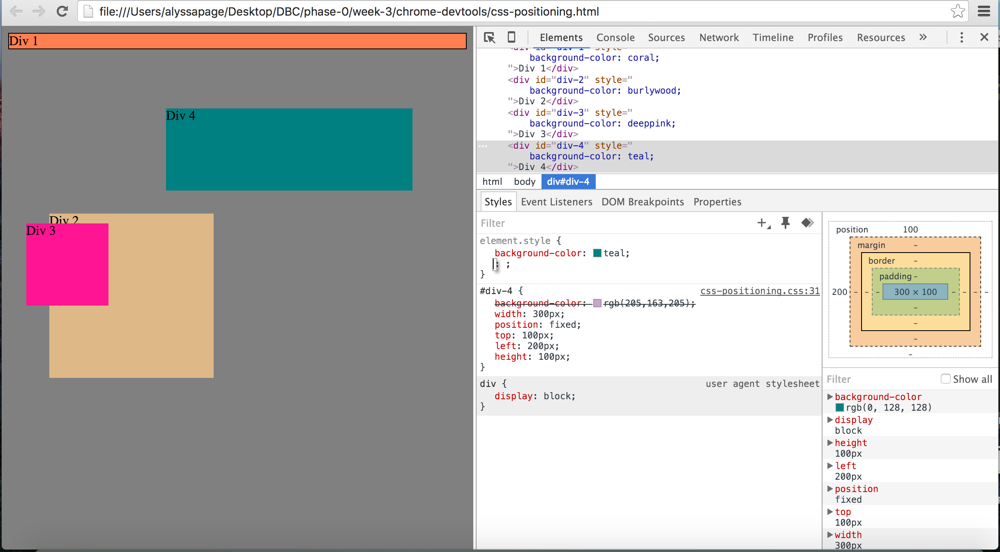
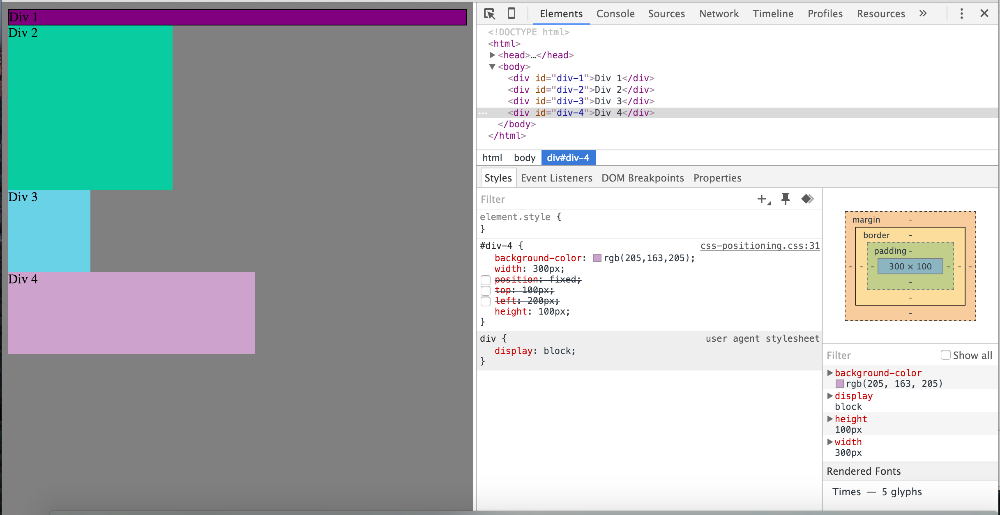
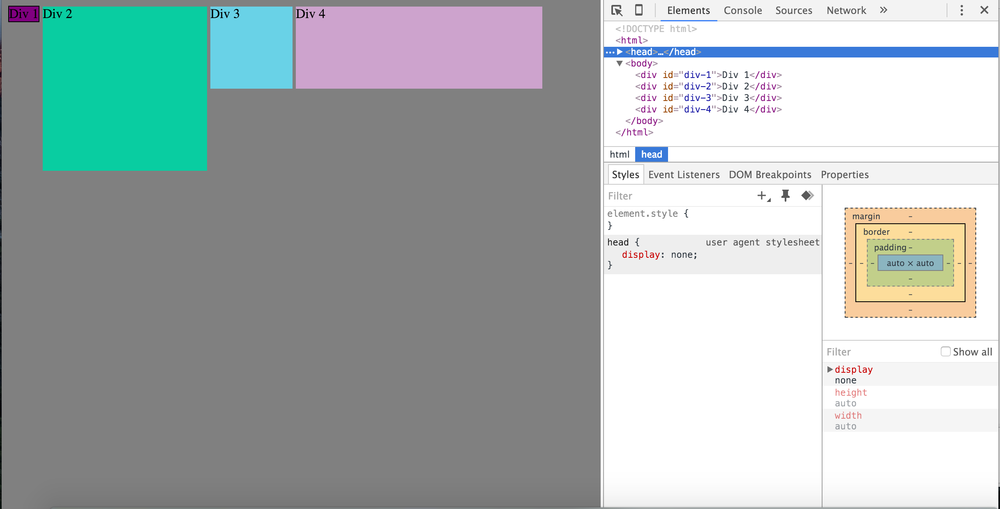
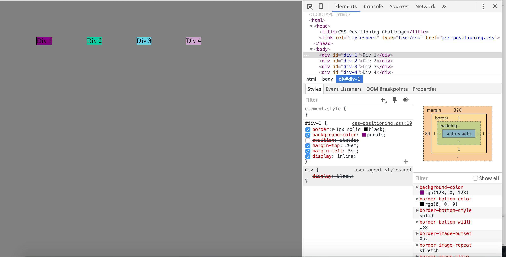
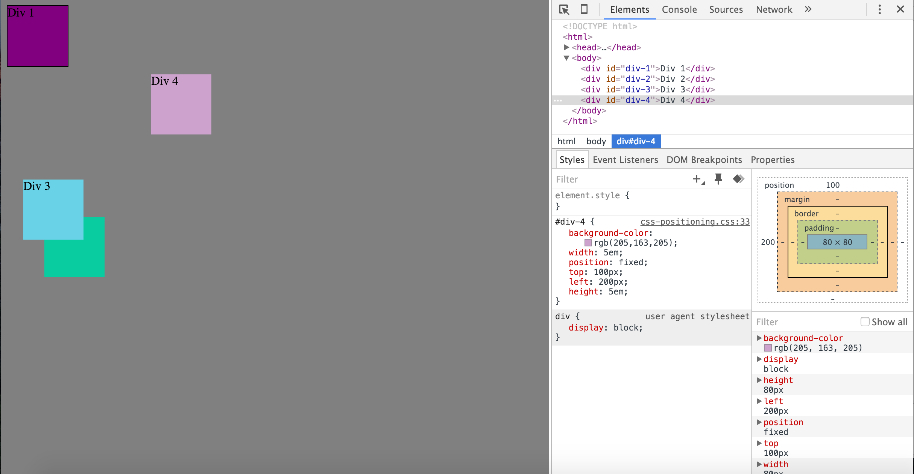
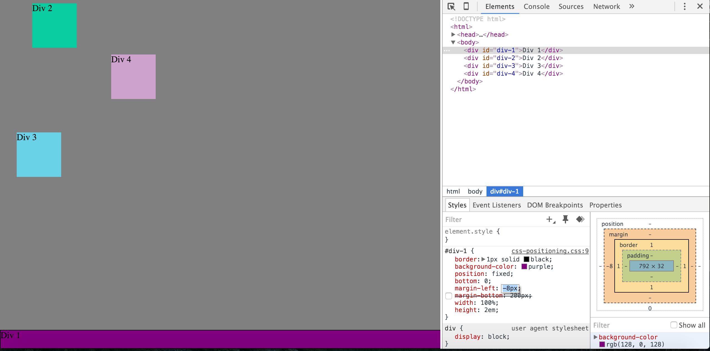
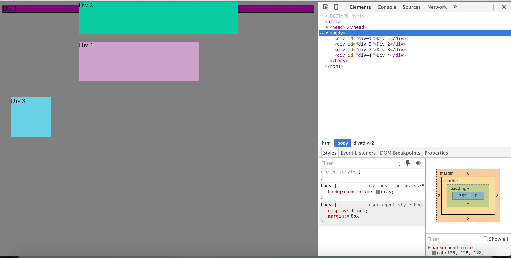
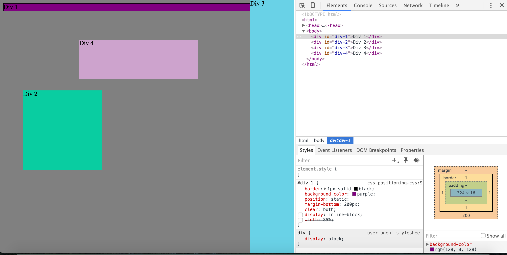
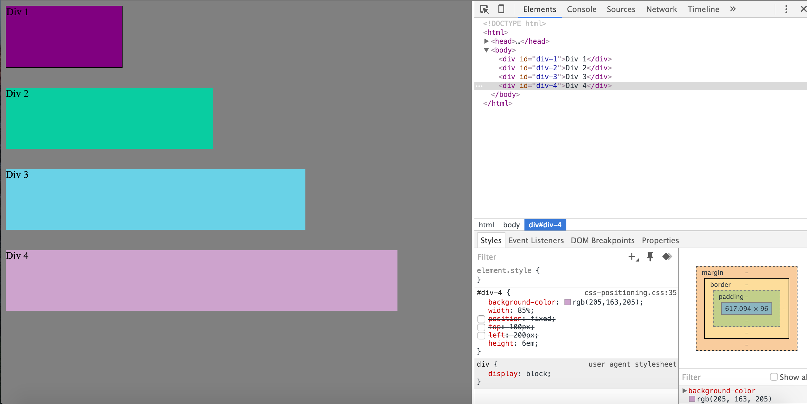

1. How can you use Chrome's DevTools inspector to help you format or position elements?

You can use the DevTools inspector to make changes to code and compare what it does instantaneously. It allows for deselecting formatting or coding new formatting or positioning in the browser. This can make it easier to make design decisions. 

2. How can you resize elements on the DOM using CSS?
You can resize elements using height and width properties. Each of these can have values of px, em, or %.

3. What are the differences between absolute, fixed, static, and relative positioning? Which did you find easiest to use? Which was most difficult?
absolute : positioned relative to its first non-static relative element
fixed : positioned relative to browser window
static : this is the default value and is positioned as it appears in the document flow
relative : positioned relative to its normal position
I found fixed easiest to use, but I think it is pretty easy to get positioning mixed up. I will keep working on it and using it to get more comfortable with what each of them do. 

4. What are the differences between margin, border, and padding?
margin : the space outside the border and surrounding elements
border : outside of the element and defines the edge
padding : area between the content of the element and the border 

5. What was your impression of this challenge overall? (love, hate, and why?)
I really enjoyed it for the most part. Even when I got frustrated that the CSS wasn't working like I thought it would it was a good feeling when we finally figured out what we should do. There is a lot of trial and error and I liked being able to play around and figure it out.