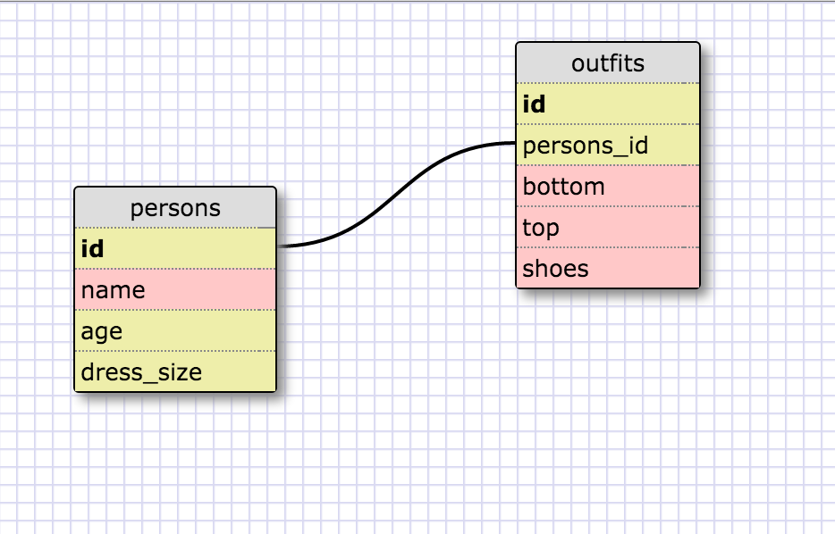

1. Select all data for all states.   
SELECT * FROM states;

2. Select all data for all regions.   
SELECT * FROM regions;

3. Select the state_name and population for all states.   
SELECT state_name, population FROM states;

4. Select the state_name and population for all states ordered by population. The state with the highest population should be at the top.   
SELECT state_name, population
FROM states
ORDER BY population DESC;

5. Select the state_name for the states in region 7.   
SELECT state_name
FROM states
WHERE region_id = 7;

6. Select the state_name and population_density for states with a population density over 50 ordered from least to most dense.   
SELECT state_name, population_density
FROM states
WHERE population_density > 50
ORDER BY population_density ASC;

7. Select the state_name for states with a population between 1 million and 1.5 million people.   
SELECT state_name
FROM states
WHERE population BETWEEN 1000000 AND 1500000;

8. Select the state_name and region_id for states ordered by region in ascending order.   
SELECT state_name, region_id
FROM states
ORDER BY region_id ASC;

9. Select the region_name for the regions with "Central" in the name.   
SELECT * FROM regions
WHERE region_name LIKE '%central%';

10. Select the region_name and the state_name for all states and regions in ascending order by region_id. Refer to the region by name. (This will involve joining the tables).   
ELECT regions.region_name, states.state_name
FROM states
INNER JOIN regions
ON states.region_id = regions.id
ORDER BY region_id ASC;

1. What are databases for?   
Databases are for organizing and storing data. Databases make it easy to access, modify and remove this data.

2. What is a one-to-many relationship?   
With A and B where an element of A may be linked to many elements of B but a memeber of B is linked to only one element of A. For example a bio mother can have many children but a child can have only one bio mother.

3. What is a primary key? What is a foreign key? How can you determine which is which?   
Primary keys uniquely identify each row in the table, they are frequently defined on the identity column. Foreign keys establish a link between two tables when a primary key of one table is referenced by the column in another table. 

4. How can you select information out of a SQL database? What are some general guidelines for that?  
using keyword SELECT and identifying what table you want to select from. If you want all information from table "dogs"   
SELECT * FROM dogs; 

