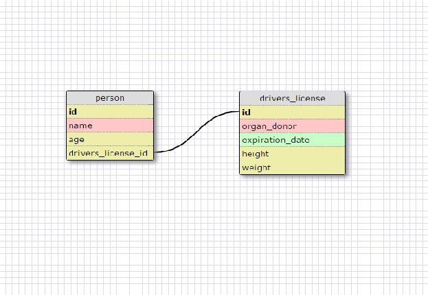

What is a one-to-one database?   
When things are a pair. One example is a person and a drivers license number. Each person only has one number and one number only belongs to one number.

When would you use a one-to-one database? (Think generally, not in terms of the example you created).   
When you want to create a paired relationship.

What is a many-to-many database?   
They have a join table. Many things are connected to many other things. One example is challenges done by students. Each student does many challenges and also each challenge is done by many student.

When would you use a many-to-many database? (Think generally, not in terms of the example you created).   
When you want to create relationships with a join table where many things are intertwined.

What is confusing about database schemas? What makes sense?   
One to one is somewhat confusing because the pair doesnt have to exist. For example not everyone has to have a drivers license. But if they do they only have the one number.
